# Meine Lagersteuerung - Code-Dokumentation

## Übersicht
Diese Dokumentation beschreibt meine Implementierung der Lagersteuerung mit Petrinetz-Logik in Structured Text (ST). Das System steuert einen automatisierten Lagerbereich mit Transportarm, Förderband und Pufferstrecke.

## System-Architektur

```mermaid
---
title: Meine System-Architektur
---
flowchart TD
    subgraph Eingänge ["🔌 Meine Eingänge"]
        IX10["IX1.0 - Werkstück angesaugt"]
        IX11["IX1.1 - Lager leer"]
        IX12["IX1.2 - Schieber eingefahren"]
        IX13["IX1.3 - Schieber ausgefahren"]
        IX14["IX1.4 - Arm am Band"]
        IX15["IX1.5 - Arm am Lager"]
        IX02["IX0.2 - LS1 Start"]
        IX03["IX0.3 - LS2 Vereinzeler"]
        IX04["IX0.4 - LS3 Ende"]
    end
    
    subgraph Steuerung ["⚙️ Meine SPS-Steuerung"]
        START["START Signal"]
        AUTO["AUTO Wahlschalter"]
        PETRI["Petrinetz S0-S6"]
        FB["Pufferstrecken FB"]
    end
    
    subgraph Ausgänge ["🔌 Meine Ausgänge"]
        QX10["QX1.0 - Schieber ausfahren"]
        QX11["QX1.1 - Werkstück ansaugen"]
        QX12["QX1.2 - Werkstück loslassen"]
        QX13["QX1.3 - Arm zum Lager"]
        QX14["QX1.4 - Arm zum Band"]
        QX00["QX0.0 - Vereinzeler auf"]
        QW2["QW2 - Bandgeschwindigkeit"]
    end
    
    Eingänge --> Steuerung
    Steuerung --> Ausgänge
```

## Meine Betriebsarten-Steuerung


## Mein Automatikzyklus (Petrinetz)


## Meine Code-Struktur

```mermaid
---
title: Meine Code-Ablauf-Struktur
---
flowchart TD
    START_PROG["🚀 Programmstart"]
    
    subgraph INIT ["📋 Meine Initialisierung"]
        FLANKE["START-Flanke erkennen"]
        AUTO_LOCK["AUTO-Sperrung prüfen"]
        MODE_SELECT["Betriebsart wählen"]
    end
    
    subgraph RESET ["🔄 Mein System-Reset"]
        CLEAR_STATES["Alle Zustände löschen"]
        RESET_OUTPUTS["Ausgänge zurücksetzen"]
        SET_INIT["S_INIT = TRUE"]
    end
    
    subgraph MANUAL ["🖐️ Mein Handbetrieb"]
        MANUAL_INPUTS["Manuelle Eingaben lesen"]
        SAFETY_LOCKS["Sicherheitsverriegelungen"]
        MANUAL_OUTPUTS["Direkte Ausgabe-Steuerung"]
    end
    
    subgraph AUTOMATIC ["🤖 Mein Automatikbetrieb"]
        PETRI_LOGIC["Petrinetz-Logik S0-S6"]
        TRANSITIONS["Transitionen prüfen"]
        OUTPUT_ASSIGN["Ausgänge zuweisen"]
    end
    
    subgraph BUFFER ["📦 Meine Pufferstrecke"]
        FB_INPUTS["FB-Eingänge setzen"]
        FB_EXECUTE["Funktionsbaustein ausführen"]
        FB_OUTPUTS["FB-Ausgänge übernehmen"]
    end
    
    START_PROG --> INIT
    INIT --> MODE_SELECT
    MODE_SELECT --> MANUAL
    MODE_SELECT --> AUTOMATIC
    MODE_SELECT --> RESET
    
    MANUAL --> BUFFER
    AUTOMATIC --> BUFFER
    RESET --> INIT
    
    BUFFER --> START_PROG
    
    classDef startStyle fill:#FFE4E1,stroke:#FF6B6B,stroke-width:3px
    classDef initStyle fill:#E6F3FF,stroke:#4A90E2,stroke-width:2px
    classDef processStyle fill:#E6FFE6,stroke:#4AE24A,stroke-width:2px
    classDef resetStyle fill:#FFF0E6,stroke:#FF8C00,stroke-width:2px
    
    class START_PROG startStyle
    class INIT,BUFFER initStyle
    class MANUAL,AUTOMATIC processStyle
    class RESET resetStyle
```



## Meine Variablen-Organisation


## Meine Sicherheitslogik

```mermaid
---
title: Meine Sicherheits- und Verriegelungslogik
---
flowchart TD
    subgraph SAFETY ["🛡️ Meine Sicherheitsfeatures"]
        AUTO_LOCK_CHECK["AUTO-Sperrung bei START=TRUE"]
        MUTUAL_EX1["Ansaugen XOR Loslassen"]
        MUTUAL_EX2["Arm Lager XOR Arm Band"]
        INIT_RESET["Ausgänge bei INIT zurücksetzen"]
    end
    
    subgraph CONDITIONS ["⚠️ Meine Bedingungsprüfungen"]
        LAGER_CHECK["Lager nicht leer"]
        LS1_CHECK["LS1 frei für neues Werkstück"]
        SENSOR_CHECK["Sensoren für Transitionen"]
        POSITION_CHECK["Positionssensoren"]
    end
    
    subgraph DEBUG ["🐛 Meine Debug-Features"]
        SKIP_BUFFER["DEBUG_Ueberspringe_Puffer"]
        USE_FB["DEBUG_Nutze_Funktionsbaustein"]
        STATUS_TEXT["Status_Text für Diagnose"]
    end
    
    SAFETY --> CONDITIONS
    CONDITIONS --> DEBUG
```



## Meine Transitionen im Detail

```mermaid
---
title: Meine Petrinetz-Transitionen mit Bedingungen
---
flowchart TD
    S0["S0: Bereit"] --> T1{{"T1: Werkstück ausfahren"}}
    T1 --> |"NOT Lager_Leer AND LS1_Start"| S1["S1: Schieber ausfahren"]
    
    S1 --> T2{{"T2: Arm zum Lager"}}
    T2 --> |"Ausschieber_Ausgefahren"| S2["S2: Arm zum Lager"]
    
    S2 --> T3{{"T3: Werkstück ansaugen"}}
    T3 --> |"Transportarm_am_Lager AND Ausschieber_Eingefahren"| S3["S3: Ansaugen"]
    
    S3 --> T4{{"T4: Transport zum Band"}}
    T4 --> |"Werkstueck_Angesaugt"| S4["S4: Transport"]
    
    S4 --> T5{{"T5: Werkstück ablegen"}}
    T5 --> |"Transportarm_am_Band"| S5["S5: Ablegen"]
    
    S5 --> T6{{"T6: Pufferstrecke starten"}}
    T6 --> |"NOT LS1_Start"| S6["S6: Pufferstrecke"]
    
    S6 --> T7{{"T7: Zyklus beenden"}}
    T7 --> |"FB Prozess_Abgeschlossen"| S0
    
    classDef stateStyle fill:#E6F3FF,stroke:#4A90E2,stroke-width:2px
    classDef transitionStyle fill:#FFE6E6,stroke:#E24A4A,stroke-width:2px
    
    class S0,S1,S2,S3,S4,S5,S6 stateStyle
    class T1,T2,T3,T4,T5,T6,T7 transitionStyle
```


## Meine Ausgangszuweisungen

```mermaid
---
title: Meine Ausgangszuweisungen pro Zustand
---
flowchart LR
    subgraph STATES ["🔄 Meine Zustände"]
        S1_STATE["S1"]
        S2_STATE["S2"]
        S3_STATE["S3"]
        S4_STATE["S4"]
        S5_STATE["S5"]
    end
    
    subgraph OUTPUTS ["🔌 Meine Ausgänge"]
        SCHIEBER["Schieber_Ausfahren"]
        ANSAUGEN["Werkstueck_Ansaugen"]
        LOSLASSEN["Werkstueck_Loslassen"]
        ARM_LAGER["Transportarm_zum_Lager"]
        ARM_BAND["Transportarm_zum_Band"]
    end
    
    S1_STATE --> SCHIEBER
    S2_STATE --> ARM_LAGER
    S3_STATE --> ARM_LAGER
    S3_STATE --> ANSAUGEN
    S4_STATE --> ANSAUGEN
    S4_STATE --> ARM_BAND
    S5_STATE --> ARM_BAND
    S5_STATE --> LOSLASSEN
    
    classDef stateStyle fill:#E6F3FF,stroke:#4A90E2,stroke-width:2px
    classDef outputStyle fill:#FFE6E6,stroke:#E24A4A,stroke-width:2px
    
    class S1_STATE,S2_STATE,S3_STATE,S4_STATE,S5_STATE stateStyle
    class SCHIEBER,ANSAUGEN,LOSLASSEN,ARM_LAGER,ARM_BAND outputStyle
```



## Meine Code-Logik im Detail

### Meine START-Flankenauswertung
```st
(* Meine START Flankenauswertung - ID 04 *)
START_Flanke := START AND NOT START_Alt;
START_Alt := START;
```

### Meine AUTO-Sperrung
```st
(* Meine AUTO-Sperrung bei START=TRUE - ID 03 *)
IF START THEN
    AUTO_Gesperrt := TRUE;
    AUTO := AUTO_Alt;  (* Friere mein AUTO ein *)
ELSE
    AUTO_Gesperrt := FALSE;
    AUTO_Alt := AUTO;  (* Merke mir meinen AUTO-Wert *)
END_IF;
```

### Meine Funktionsbaustein-Integration
```st
(* Meine FB-Eingänge versorgen *)
Pufferstrecken_Steuerung.EINAUS := AUTOMATIKBETRIEB;
Pufferstrecken_Steuerung.RESET_PRODUKTIONSZAEHLER := NOT START;
Pufferstrecken_Steuerung.LS1_START := LS1_Start;
Pufferstrecken_Steuerung.LS2_VEREINZELER := LS2_Vereinzeler;
Pufferstrecken_Steuerung.LS3_ENDE := LS3_Ende;

(* Mein FB ausführen *)
Pufferstrecken_Steuerung();

(* Meine FB-Ausgänge übernehmen *)
IF AUTOMATIKBETRIEB THEN
    Bandgeschwindigkeit := Pufferstrecken_Steuerung.Bandgeschwindigkeit;
    Vereinzeler_Auf := Pufferstrecken_Steuerung.VEREINZELER_AUF;
    Teile_Zaehler := Pufferstrecken_Steuerung.ANZEIGE_PRODUKTIONSZAHL;
END_IF;
```


```ST
PROGRAM POU
VAR
(* +++ Instanz des Funktionsbausteins für die Pufferstrecke (bereits vorhanden) +++ *)
    Pufferstrecken_Steuerung : Vereinzeln_FUP_FB;
	DEBUG_Ueberspringe_Puffer : BOOL := FALSE; (* Schalter in Visu, um S6/S7 zu überspringen *)
	DEBUG_Nutze_Funktionsbaustein : BOOL := TRUE; (* TRUE = Neuer FB, FALSE = Alte Logik *)
(* Betriebsarten *)
    START : BOOL := FALSE; (* Startsignal für das gesamte System *)
    AUTO : BOOL := FALSE; (* Wahlschalter für Automatikbetrieb (TRUE) oder Handbetrieb (FALSE) *)
    
(* Petrinetz Stellen - Zustände im Automatikbetrieb *)
    S_INIT : BOOL := TRUE;  (* Initialzustand des Systems / Petrinetzes *)
    HANDBETRIEBSMODUS : BOOL := FALSE; (* Flag: Handbetrieb ist aktiv *)
    AUTOMATIKBETRIEB : BOOL := FALSE; (* Flag: Automatikbetrieb ist aktiv *)
    S0 : BOOL := FALSE;         (* Stelle 0: Grundstellung / Warten auf Werkstück oder Freigabe *)
    S1 : BOOL := FALSE;     (* Stelle 1: Werkstück wird aus dem Lager ausgeschoben *)
    S2 : BOOL := FALSE;     (* Stelle 2: Transportarm fährt zum Lager *)
    S3 : BOOL := FALSE;     (* Stelle 3: Werkstück wird am Lager angesaugt *)
    S4 : BOOL := FALSE;     (* Stelle 4: Transportarm fährt mit Werkstück zum Band *)
    S5 : BOOL := FALSE;     (* Stelle 5: Werkstück wird auf dem Band abgelegt *)
    S6 : BOOL := FALSE;

	(* --- Auskommentiert: Diese Deklarationen sind doppelt oder werden vom FB verwaltet --- *)
    // Timer und Zaehler
    Timer_Band : TON;
    //Teile_Zaehler : INT := 0; (* Zaehler bleibt hier, da er im Hauptprogramm verwendet wird *)
    Timer_Band_Zeit : TIME := T#60S;
    Teile_Zaehler : WORD; 
    (* Handbetrieb Variablen - Steuersignale für den manuellen Betrieb *)
    Hand_Schieber_Ausfahren: BOOL := FALSE; (* Manueller Befehl: Schieber ausfahren *)
    Hand_WK_Ansaugen : BOOL := FALSE;     (* Manueller Befehl: Werkstück ansaugen *)
    Hand_WK_Loslassen : BOOL := FALSE;    (* Manueller Befehl: Werkstück loslassen *)
    Hand_Arm_zum_Lager : BOOL := FALSE;    (* Manueller Befehl: Transportarm zum Lager fahren *)
    Hand_Arm_zum_Band : BOOL := FALSE;     (* Manueller Befehl: Transportarm zum Band fahren *)
    Hand_Band_Einschalten : BOOL := FALSE;   (* Manueller Befehl: Band einschalten *)
    Hand_Bandgeschwindigkeit : WORD := 0;       (* Manuell einstellbare Bandgeschwindigkeit *)
    Hand_Vereinzeler : BOOL := FALSE;  (* Manueller Befehl: Vereinzeler betätigen *)
    
    (* Hilfsvariablen *)
    START_Alt : BOOL := FALSE;         (* Speichert den vorherigen Zustand des START-Signals zur Flankenerkennung *)
    START_Flanke : BOOL := FALSE;      (* Positive Flanke des START-Signals (TRUE für einen Zyklus) *)
    AUTO_Alt : BOOL := FALSE;          (* Speichert den vorherigen Zustand des AUTO-Wahlschalters *)
    AUTO_Gesperrt : BOOL := FALSE;     (* Sperrt die Umschaltung des AUTO-Modus während des Betriebs (START = TRUE) *)
    Status_Text : STRING := 'System bereit'; (* Textuelle Anzeige des aktuellen Systemstatus für die Visualisierung *)
    
    (* Eingaenge - Abbildung der Hardware-Eingänge auf Variablen *)
    Werkstueck_Angesaugt AT %IX1.0 : BOOL; (* Sensor: Werkstück ist vom Transportarm angesaugt *)
    Lager_Leer AT %IX1.1 : BOOL;           (* Sensor: Das Lager enthält keine Werkstücke mehr *)
    Ausschieber_Eingefahren AT %IX1.2: BOOL; (* Sensor: Der Ausschieber ist in der hinteren Endlage (eingefahren) *)
    Ausschieber_Ausgefahren AT %IX1.3: BOOL; (* Sensor: Der Ausschieber ist in der vorderen Endlage (ausgefahren) *)
    Transportarm_am_Band AT %IX1.4: BOOL;          (* Sensor: Der Transportarm befindet sich an der Position "Band" *)
    Transportarm_am_Lager : BOOL := %IX1.5;         (* Sensor: Der Transportarm befindet sich an der Position "Lager" *)
    Vereinzeler_ist_auf AT %IX0.0:BOOL;      (* Sensor: Der Vereinzeler ist geöffnet *)
    Vereinzeler_ist_zu AT %IX0.1 : BOOL;       (* Sensor: Der Vereinzeler ist geschlossen *)
    LS1_Start AT %IX0.2:BOOL;             (* Lichtschranke 1 (Start der Pufferstrecke): TRUE, wenn frei *)
    LS2_Vereinzeler AT %IX0.3:BOOL;             (* Lichtschranke 2 (vor Vereinzeler): TRUE, wenn frei *)
    LS3_Ende AT %IX0.4:BOOL;             (* Lichtschranke 3 (Ende der Pufferstrecke): TRUE, wenn frei *)
    
    (* Ausgaenge - Abbildung der Variablen auf Hardware-Ausgänge *)
	Vereinzeler_Auf AT %QX0.0 : BOOL; (* Aktor: Befehl Vereinzeler öffnen *)
    Schieber_Ausfahren AT %QX1.0 : BOOL;   (* Aktor: Befehl zum Ausfahren des Schiebers *)
    Werkstueck_Ansaugen AT %QX1.1:BOOL;  (* Aktor: Befehl zum Ansaugen des Werkstücks *)
    Werkstueck_Loslassen AT %QX1.2:BOOL; (* Aktor: Befehl zum Loslassen des Werkstücks *)
    Transportarm_zum_Lager AT %QX1.3: BOOL;        (* Aktor: Befehl zum Bewegen des Transportarms Richtung Lager *)
    Transportarm_zum_Band AT %QX1.4: BOOL;         (* Aktor: Befehl zum Bewegen des Transportarms Richtung Band *)
    Band_Drehrichtung AT %QX0.1:BOOL;    (* Aktor: Drehrichtung des Förderbands (Standard = 0) *)
    Bandgeschwindigkeit AT %QW2:WORD;    (* Aktor: Geschwindigkeit des Förderbands *)
    Bandgeschwindigkeit_max : WORD := 32500; (* Konstante: Maximalwert für Bandgeschwindigkeit *)
    Bandgeschwindigkeit_min : WORD := 0;     (* Konstante: Minimalwert für Bandgeschwindigkeit (Band Stopp) *)
	
END_VAR


(* START Flankenauswertung - ID 04 *)
START_Flanke := START AND NOT START_Alt;
START_Alt := START;

(* AUTO-Sperrung bei START=TRUE - ID 03 *)
IF START THEN
    AUTO_Gesperrt := TRUE;
    AUTO := AUTO_Alt;  (* AUTO einfrieren *)
ELSE
    AUTO_Gesperrt := FALSE;
    AUTO_Alt := AUTO;  (* AUTO-Wert merken *)
END_IF;

(* Initialisierung bei START-Flanke - ID 01,02 *)
IF START_Flanke THEN
    IF AUTO THEN
        S_INIT := FALSE;
        AUTOMATIKBETRIEB := TRUE;
        S0 := TRUE;         (* Automatik startet in S0 *)
        Teile_Zaehler := 0;
        Status_Text := 'Automatikbetrieb aktiv';
    ELSE
        S_INIT := FALSE;
        HANDBETRIEBSMODUS := TRUE;
        Status_Text := 'Handbetrieb aktiv';
    END_IF;
END_IF;

(* System zuruecksetzen bei START = FALSE *)
IF NOT START THEN
    S_INIT := TRUE;
    HANDBETRIEBSMODUS := FALSE;
    AUTOMATIKBETRIEB := FALSE;
    S0 := FALSE; S1 := FALSE; S2 := FALSE; S3 := FALSE;
    S4 := FALSE; S5 := FALSE;
    S6 := FALSE; //-- Auskommentiert, da Zustand nicht mehr verwendet wird *)
    (* Timer_Band(IN := FALSE, PT := T#2s); -- Auskommentiert, Timer ist jetzt im FB *)
	Timer_Band(IN := FALSE);
    Status_Text := 'System bereit';
END_IF;

(* Ausgaenge zuruecksetzen bei INIT *)
IF S_INIT THEN
    Schieber_Ausfahren := FALSE;
    Werkstueck_Ansaugen := FALSE;
    Werkstueck_Loslassen := FALSE;
    Transportarm_zum_Lager := FALSE;
    Transportarm_zum_Band := TRUE;
    Vereinzeler_Auf := FALSE;
    Band_Drehrichtung := FALSE;
    Bandgeschwindigkeit := 0;
END_IF;

(* HANDBETRIEB *)
IF HANDBETRIEBSMODUS THEN
    Schieber_Ausfahren := Hand_Schieber_Ausfahren;
    Werkstueck_Ansaugen := Hand_WK_Ansaugen AND NOT Hand_WK_Loslassen;
    Werkstueck_Loslassen := Hand_WK_Loslassen AND NOT Hand_WK_Ansaugen;
    Transportarm_zum_Lager := Hand_Arm_zum_Lager AND NOT Hand_Arm_zum_Band;
    Transportarm_zum_Band := Hand_Arm_zum_Band AND NOT Hand_Arm_zum_Lager;
    Vereinzeler_Auf := Hand_Vereinzeler;
    
    IF Hand_Band_Einschalten THEN
        Bandgeschwindigkeit := Hand_Bandgeschwindigkeit;
    ELSE
        Bandgeschwindigkeit := 0;
    END_IF;
END_IF;

(* AUTOMATIKBETRIEB *)
IF AUTOMATIKBETRIEB THEN
    (* T1: Werkstueck ausfahren *)
    IF (S0 AND NOT S1 AND NOT Lager_Leer AND LS1_Start) THEN
        S0 := FALSE;
        S1 := TRUE;
    END_IF;
    
    (* T2: Transportarm zum Lager *)
    IF (S1 AND NOT S2 AND Ausschieber_Ausgefahren) THEN
        S1 := FALSE;
        S2 := TRUE;
    END_IF;
    
    (* T3: Werkstueck ansaugen *)
//	IF (S2 AND NOT S3 AND Transportarm_am_Lager AND Ausschieber_Eingefahren) THEN
    IF (S2 AND Transportarm_am_Lager AND Ausschieber_Eingefahren AND NOT S3 AND NOT Ausschieber_Ausgefahren) THEN
        S2 := FALSE;
        S3 := TRUE;
    END_IF;
    
    (* T4: Transport zum Band *)
    IF (S3 AND NOT S4 AND Werkstueck_Angesaugt) THEN
        S3 := FALSE;
        S4 := TRUE;
    END_IF;

    (* T5: Werkstueck ablegen *)
    IF (S4 AND NOT S5 AND Transportarm_am_Band) THEN
        S4 := FALSE;
        S5 := TRUE;
//        Teile_Zaehler := Teile_Zaehler + 1;
    END_IF;

	//     
	//     (* T6: Band starten - Zeittransition *)
	// 	IF (S5 AND NOT LS1_Start AND NOT S6) THEN
	// 		Timer_Band(IN := TRUE, PT := T#2S); // T#60s
	// 	ELSE
	// 		Timer_Band(IN := FALSE);
	// 	END_IF;
	//     IF Timer_Band.Q THEN
	//         S5 := FALSE;
	//         S6 := TRUE;
	//     END_IF;
	// 		
	//     (* T7: Zyklus beenden *)
	//     IF (S6 AND NOT S0) THEN
	//         S6 := FALSE;
	//         S0 := TRUE;
	//     END_IF;

    (* +++++++++++++++++++++++++++++++++++++++++++++++++++++++++++++++++++++ *)
    (* +++ NEU: DEBUG-Abfrage, um die Pufferstrecke zu überspringen +++ *)
    (* +++++++++++++++++++++++++++++++++++++++++++++++++++++++++++++++++++++ *)
    IF S5 AND DEBUG_Ueberspringe_Puffer THEN
        S5 := FALSE; (* Deaktiviere den aktuellen Zustand S5 *)
        S0 := TRUE;  (* Springe direkt zum Zyklus-Anfang zurück *)
    END_IF;
    (* +++++++++++++++++++++++++++++++++++++++++++++++++++++++++++++++++++++ *)
	
    (* T6: Transportphase SOFORT starten, wenn LS1 belegt ist *)
	IF (S5 AND NOT LS1_Start AND NOT S6) THEN
		S5 := FALSE;
		S6 := TRUE;
	END_IF;
 
    (* ######################################################################## *)
    (* ####### STEUERUNG DER PUFFERSTRECKE (S6) - UMSCHALTBAR ####### *)
	(* ######################################################################## *)

	//     IF DEBUG_Nutze_Funktionsbaustein THEN
	//         
	//         (* ==================================================================== *)
	//         (* ====== VARIANTE 1: Steuerung durch den NEUEN Funktionsbaustein ====== *)
	//         (* ==================================================================== *)
	//         
	//         IF S6 THEN
	//             (* 1. FB-Eingänge versorgen *)
	//             Pufferstrecken_Steuerung.EINAUS         := TRUE;
	//             Pufferstrecken_Steuerung.LS1_START       := LS1_Start;
	//             Pufferstrecken_Steuerung.LS2_VEREINZELER := LS2_Vereinzeler;
	//             Pufferstrecken_Steuerung.LS3_ENDE        := LS3_Ende;
	//             
	//             (* 2. FB ausführen *)
	//             Pufferstrecken_Steuerung();
	//             
	//             (* 3. FB-Ausgänge an Aktoren weitergeben *)
	//             Bandgeschwindigkeit := Pufferstrecken_Steuerung.Bandgeschwindigkeit;
	//             Vereinzeler_Auf     := Pufferstrecken_Steuerung.Vereinzeler_auf;
	//             
	//             (* T7: Zyklus beenden, wenn der FB fertig ist *)
	//             IF Pufferstrecken_Steuerung.Prozess_Abgeschlossen THEN
	//                 S6 := FALSE;
	//                 S0 := TRUE;
	//             END_IF;
	// 
	//         ELSE
	//             (* FB zurücksetzen, wenn S6 nicht aktiv ist *)
	// //            Pufferstrecken_Steuerung.EINAUS := FALSE;
	//             Pufferstrecken_Steuerung();
	//         END_IF;
	// 
	//     ELSE
	//   
	//         (* ================================================================== *)
	//         (* ====== VARIANTE 2: Steuerung durch die ALTE, monolithische Logik ====== *)
	//         (* ================================================================== *)
	//         
	//         (* T7: Zyklus beenden, NACHDEM das Band in S6 für 2s gelaufen ist *)
	//         Timer_Band(IN := S6, PT := Timer_Band_Zeit); (* Timer läuft, solange S6 aktiv ist *)
	//         
	//         IF (Timer_Band.Q AND S6) THEN (* Wenn Timer fertig UND wir noch in S6 sind *)
	//             S6 := FALSE;
	//             S0 := TRUE;
	//         END_IF;
	//         
	//         IF S6 THEN
	//             Bandgeschwindigkeit := Bandgeschwindigkeit_max;
	//         ELSE
	//             Bandgeschwindigkeit := Bandgeschwindigkeit_min;
	//         END_IF;
	//         
	//     END_IF; (* Ende der Umschaltung *)

    (* ######################################################################## *)
    (* ####### ENDE STEUERUNG DER PUFFERSTRECKE ####### *)
    (* ######################################################################## *)

    (* Ausgangszuweisungen *)
    Schieber_Ausfahren := S1; // S1 OR S2 OR (S3 AND NOT Werkstueck_Angesaugt);
    Werkstueck_Ansaugen := (S3 OR S4) AND Transportarm_am_Lager AND Ausschieber_Eingefahren; // S3 OR S4;
	Werkstueck_Loslassen :=  S5 AND Transportarm_am_Band; 
    Transportarm_zum_Lager := S2 OR S3;
    Transportarm_zum_Band := S4 OR S5;
END_IF


(* --- TEIL 2: Der Funktionsbaustein für die Pufferstrecke läuft IMMER parallel --- *)
(* Dieser Block steht außerhalb der Lager-Schrittkette und wird in jedem Zyklus ausgeführt *)

(* 1. FB-Eingänge versorgen *)
Pufferstrecken_Steuerung.EINAUS:= AUTOMATIKBETRIEB;
Pufferstrecken_Steuerung.RESET_PRODUKTIONSZAEHLER := NOT START;
Pufferstrecken_Steuerung.LS1_START:= LS1_Start;
Pufferstrecken_Steuerung.LS2_VEREINZELER:= LS2_Vereinzeler;
Pufferstrecken_Steuerung.LS3_ENDE:= LS3_Ende;

(* 2. FB ausführen *)
Pufferstrecken_Steuerung();

(* 3. FB-Ausgänge an die Aktoren der Pufferstrecke weitergeben *)
IF AUTOMATIKBETRIEB THEN
    Bandgeschwindigkeit := Pufferstrecken_Steuerung.Bandgeschwindigkeit;
    Vereinzeler_Auf     := Pufferstrecken_Steuerung.VEREINZELER_AUF;
	Teile_Zaehler       := Pufferstrecken_Steuerung.ANZEIGE_PRODUKTIONSZAHL;
END_IF;
```