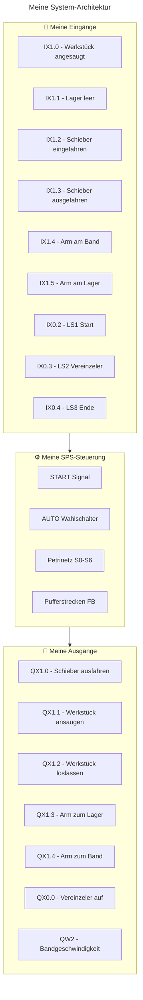
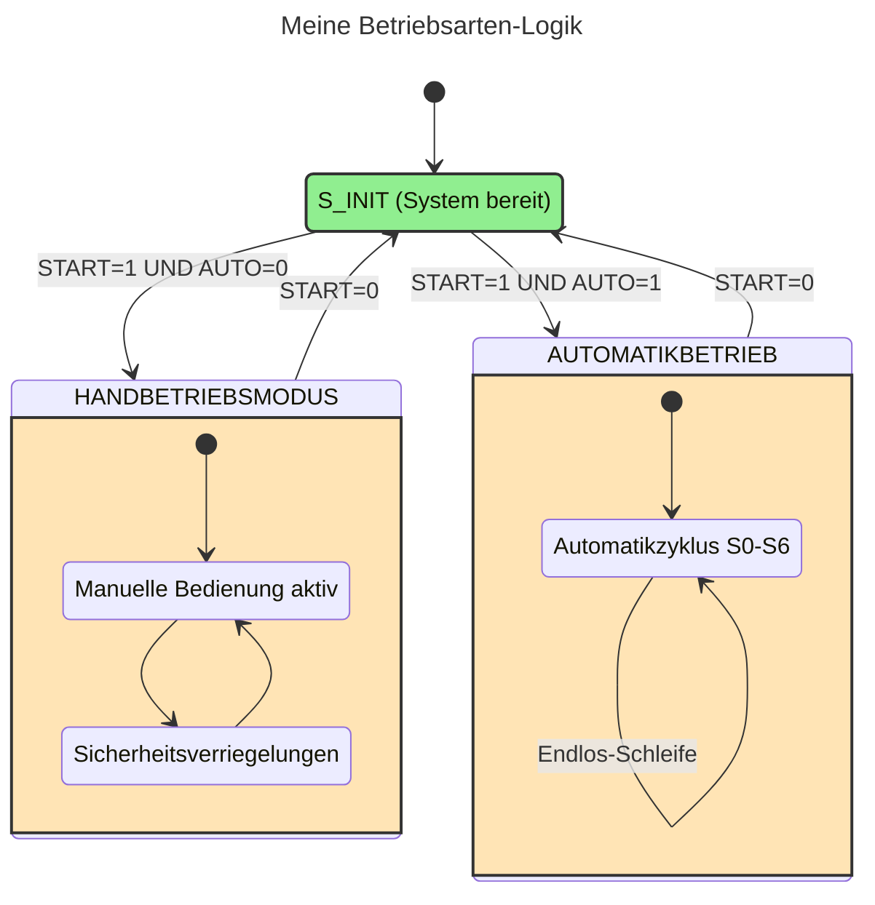
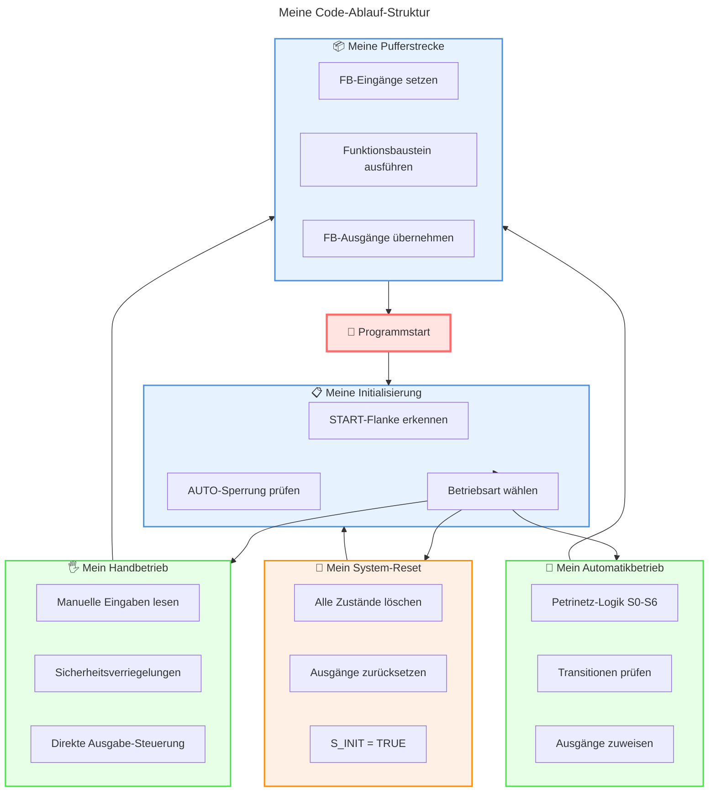
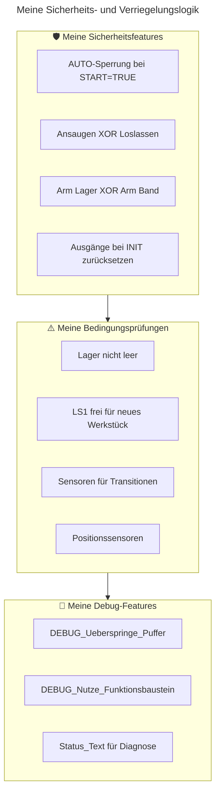
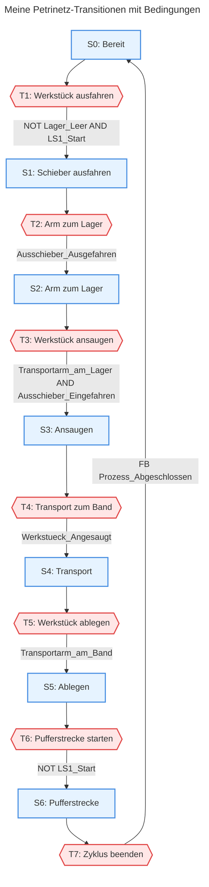
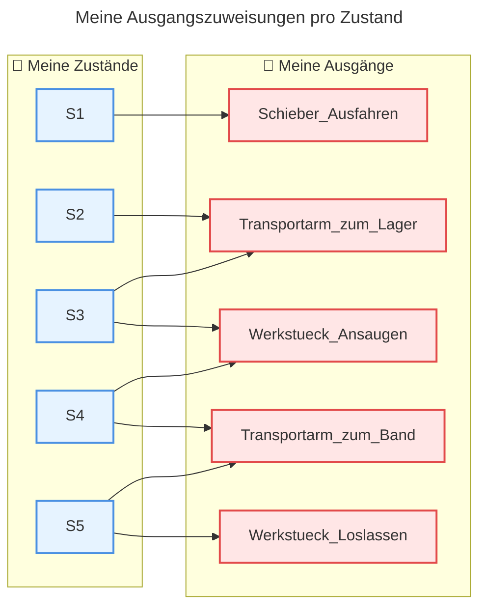

# Laborversuch 3 - Gesamtsystem mit Funktionsblock

## Was wird gemacht?
Integration von Versuch 1 (Pufferstrecke) und Versuch 2 (Petrinetz) zu einem funktionierenden Gesamtsystem. Hauptaufgabe: Einen eigenen Funktionsblock für die Bandsteuerung erstellen.

- [Laborversuch 3 - Gesamtsystem mit Funktionsblock](#laborversuch-3---gesamtsystem-mit-funktionsblock)
  - [Was wird gemacht?](#was-wird-gemacht)
  - [Dateien im Projekt](#dateien-im-projekt)
    - [📋 Hauptdokumentation](#-hauptdokumentation)
  - [💻 Implementierung](#-implementierung)
    - [1. Visualisierung erweitern (ID 01)](#1-visualisierung-erweitern-id-01)
  - [📊 Systemdokumentation](#-systemdokumentation)
    - [2. Funktionsblock erstellen (ID 02-04)](#2-funktionsblock-erstellen-id-02-04)
    - [3. Integration in Versuch 2](#3-integration-in-versuch-2)
    - [✅ Funktionsblock-Entwicklung](#-funktionsblock-entwicklung)
    - [✅ Systemintegration](#-systemintegration)
  - [System-Architektur](#system-architektur)
    - [Hauptkomponenten](#hauptkomponenten)
    - [Hardware-Zuordnung](#hardware-zuordnung)
  - [Funktionsblock-Features](#funktionsblock-features)
  - [Integration mit Petrinetz](#integration-mit-petrinetz)
    - [Koordinationslogik](#koordinationslogik)
    - [Betriebsarten](#betriebsarten)
  - [Erweiterte Visualisierung](#erweiterte-visualisierung)
    - [Neue Elemente](#neue-elemente)
  - [Was funktionieren muss](#was-funktionieren-muss)
  - [Vorbereitung (vor Labor)](#vorbereitung-vor-labor)
  - [Im Labor](#im-labor)
  - [Test-Szenarien](#test-szenarien)
    - [✅ Funktionsblock-Tests](#-funktionsblock-tests)
    - [✅ Integrations-Tests](#-integrations-tests)
  - [Testat-Kriterien](#testat-kriterien)
    - [Erforderlich für Testat](#erforderlich-für-testat)
    - [Bewertung](#bewertung)
  - [Meine System-Architektur](#meine-system-architektur)
  - [Meine Betriebsarten-Steuerung](#meine-betriebsarten-steuerung)
  - [Mein Automatikzyklus (Petrinetz)](#mein-automatikzyklus-petrinetz)
  - [Meine Code-Ablauf-Struktur](#meine-code-ablauf-struktur)
  - [Meine Variablen-Struktur](#meine-variablen-struktur)
  - [Meine Sicherheits- und Verriegelungslogik](#meine-sicherheits--und-verriegelungslogik)
  - [Meine Petrinetz-Transitionen mit Bedingungen](#meine-petrinetz-transitionen-mit-bedingungen)
  - [Meine Ausgangszuweisungen](#meine-ausgangszuweisungen)


## Dateien im Projekt
```
Laborversuch_3/
├── CODE/
│   └── Laborausarbeitung_Versuch3_Gesamtsystem.md    # Aktuelle Code-Dokumentation
└── README_Laborversuch_3.md      # Diese Datei
```

### 📋 Hauptdokumentation
- **`Laborausarbeitung_Versuch3_Gesamtsystem.md`** - Vollständige Laborausarbeitung mit Systemintegration
- **`Funktionsblock_Design.md`** - Entwurf und Spezifikation des Bandsteuerungs-Funktionsblocks

## 💻 Implementierung
### 1. Visualisierung erweitern (ID 01)
- Lichtschranken LS1, LS2, LS3 anzeigen
- Vereinzeler-Status (auf/zu) anzeigen  
- Zähler für vereinzelte Teile hinzufügen

## 📊 Systemdokumentation
### 2. Funktionsblock erstellen (ID 02-04)
```st
FUNCTION_BLOCK FB_Bandsteuerung
VAR_INPUT
    Enable : BOOL;              (* FB aktivieren *)
    Start_Band : BOOL;          (* Band starten *)
    Geschwindigkeit : WORD;     (* 0-32500 *)
    (* Hardware-Eingänge *)
    LS1_Start : BOOL;           (* %IX0.2 *)
    LS2_Vereinzeler : BOOL;     (* %IX0.3 *)
    LS3_Ende : BOOL;            (* %IX0.4 *)
    Vereinzeler_Auf : BOOL;     (* %IX0.0 *)
    Vereinzeler_Zu : BOOL;      (* %IX0.1 *)
END_VAR
VAR_OUTPUT
    (* Hardware-Ausgänge *)
    Band_Geschwindigkeit : WORD;    (* %QW2 *)
    Band_Richtung : BOOL;           (* %QX0.1 *)
    Vereinzeler_Auf_Cmd : BOOL;     (* %QX0.0 *)
    (* Status *)
    Band_Laeuft : BOOL;
    Teile_Gezaehlt : INT;
    Status_Text : STRING(50);
END_VAR
```

### 3. Integration in Versuch 2
- FB in das Petrinetz einbauen
- In Zustand S5/S6: FB aufrufen für Bandsteuerung
- Handbetrieb: FB auch manuell steuerbar machen

### ✅ Funktionsblock-Entwicklung
- **Eigenständiger FB:** `Vereinzler` mit definierten Ein-/Ausgängen
- **ST-Implementierung:** Vollständige Umsetzung in Structured Text und FUP.
- **Kapselung:** Saubere Trennung von Bandlogik und Hauptprogramm

### ✅ Systemintegration
- **Versuch 1 + 2:** Erfolgreiche Zusammenführung beider Teilsysteme
- **Gesamtanlage:** Lagerbereich + Pufferstrecke als Einheit
- **Koordination:** Synchronisierte Abläufe zwischen beiden Bereichen

## System-Architektur

### Hauptkomponenten
```
┌─────────────────┐    ┌──────────────────┐
│   LAGERBEREICH  │    │   PUFFERSTRECKE  │
│                 │    │                  │
│ • Magazin       │    │ • Förderband     │
│ • Ausschieber   │    │ • Vereinzeler    │
│ • Transportarm  │    │ • 3 Lichtschranken│
│ • Saugeinrichtung│   │                  │
└─────────────────┘    └──────────────────┘
         │                       │
         └───────────┬───────────┘
                     │
            ┌─────────────────┐
            │  GESAMTSTEUERUNG │
            │                 │
            │ • Petrinetz S0-S6│
            │ • FB_Bandsteuerung│
            │ • Visualisierung │
            └─────────────────┘
```

### Hardware-Zuordnung
```
LAGERBEREICH (IX1.x / QX1.x):
├── IX1.0: Werkstück angesaugt
├── IX1.1: Lager leer  
├── IX1.2: Ausschieber eingefahren
├── IX1.3: Ausschieber ausgefahren
├── IX1.4: Transportarm am Band
├── IX1.5: Transportarm am Lager
├── QX1.0: Schieber ausfahren
├── QX1.1: Werkstück ansaugen
├── QX1.2: Werkstück loslassen
├── QX1.3: Transportarm zum Lager
└── QX1.4: Transportarm zum Band

PUFFERSTRECKE (IX0.x / QX0.x):
├── IX0.0: Vereinzeler ist auf
├── IX0.1: Vereinzeler ist zu
├── IX0.2: LS1 (LS Start)
├── IX0.3: LS2 (LS Vereinzeler)
├── IX0.4: LS3 (LS Ende)
├── QX0.0: Vereinzeler auf
├── QX0.1: Drehrichtung Band
└── QW2: Bandgeschwindigkeit (0-32500)
```

⚠️ **Achtung:** An Platz 6 und 7 im Labor ist die Logik der LS1 (LS Start) negiert!

## Funktionsblock-Features
- **Bandsteuerung:** Geschwindigkeit, Richtung, Start/Stop
- **Vereinzeler-Logik:** Automatische Steuerung basierend auf Lichtschranken
- **Zählfunktion:** Vereinzelte Bauteile zählen
- **Statusmeldungen:** Detaillierte Rückmeldung an Hauptprogramm
- **Fehlerbehandlung:** Überwachung und Fehlermeldungen

## Integration mit Petrinetz

### Koordinationslogik
1. **S5 → FB-Aufruf:** Werkstück ablegen aktiviert Bandsteuerung
2. **FB-Status → S6:** Band-Rückmeldung steuert Petrinetz-Übergang
3. **Synchronisation:** Lager wartet auf Band-Bereitschaft
4. **Zählung:** Koordinierte Erfassung aller verarbeiteten Teile

### Betriebsarten
```st
(* Handbetrieb Pufferstrecke - über FB *)
FB_Band.Enable := HANDBETRIEBSMODUS;
FB_Band.Start_Band := Hand_Band_Start;
FB_Band.Geschwindigkeit := Hand_Band_Geschwindigkeit;

(* Automatikbetrieb - Petrinetz-Integration *)
CASE Automatik_Zustand OF
    S5: (* Werkstück ablegen *)
        FB_Band.Start_Band := TRUE;
        FB_Band.Geschwindigkeit := 16250; (* 50% Geschwindigkeit *)
        
    S6: (* Warten auf Band-Verarbeitung *)
        IF FB_Band.Teile_Gezaehlt > Letzter_Zaehlerstand THEN
            Produktions_Zaehler := Produktions_Zaehler + 1;
            Automatik_Zustand := S0; (* Zurück zum Start *)
        END_IF;
END_CASE;
```

## Erweiterte Visualisierung

### Neue Elemente
```st
(* Lichtschranken-Anzeige *)
LS1_Anzeige : BOOL := FB_Band.LS1_Start;
LS2_Anzeige : BOOL := FB_Band.LS2_Vereinzeler;  
LS3_Anzeige : BOOL := FB_Band.LS3_Ende;

(* Vereinzeler-Status *)
Vereinzeler_Status : STRING := 
    IF FB_Band.Vereinzeler_Auf THEN 'AUF'
    ELSIF FB_Band.Vereinzeler_Zu THEN 'ZU'
    ELSE 'BEWEGT' END_IF;

(* Produktionszähler *)
Teile_Vereinzelt : INT := FB_Band.Teile_Gezaehlt;
Teile_Produziert : INT := Produktions_Zaehler;
```

## Was funktionieren muss
1. **Handbetrieb:** Beide Bereiche einzeln steuerbar
2. **Automatik:** Werkstück vom Lager aufs Band, dann FB übernimmt
3. **Zählung:** Wie viele Teile wurden verarbeitet?
4. **Visualisierung:** Alle wichtigen Zustände sichtbar

## Vorbereitung (vor Labor)
- [x] FB-Interface definieren
- [x] Analyse der Integration in Versuch 2
- [ ] Überlegen: Wie rufe ich den FB auf?
- [ ] Welche Signale braucht der FB?

## Im Labor
- [ ] FB programmieren (ST-Code)
- [ ] In Hauptprogramm einbauen
- [ ] Erweiterte Visualisierung
- [ ] Testen ob alles läuft

## Test-Szenarien

### ✅ Funktionsblock-Tests
1. **Isolierter FB-Test:** Bandsteuerung ohne Lagerbereich
2. **Interface-Test:** Alle Ein-/Ausgänge korrekt verdrahtet
3. **Zählfunktion:** Vereinzelung korrekt erfasst

### ✅ Integrations-Tests  
1. **Lager → Band:** Werkstück-Übergabe funktioniert
2. **Synchronisation:** Petrinetz wartet auf Band-Bereitschaft
3. **Endlos-Betrieb:** Kontinuierlicher Automatikzyklus
4. **Handbetrieb:** Beide Bereiche manuell steuerbar

## Testat-Kriterien

### Erforderlich für Testat
- ✅ **Vorbereitung:** Funktionsblock-Prototyp vorhanden
- ⏳ **Implementierung:** FB in ST umgesetzt
- ⏳ **Integration:** Versuch 1 + 2 zusammengeführt
- ⏳ **Visualisierung:** Erweiterte Bedienoberfläche
- ⏳ **Test:** Funktionsfähiges Gesamtsystem

### Bewertung
- Vorbereitung wird zu Beginn geprüft
- Abnahme erfolgt am Ende des Labortermins
- Kein separates Protokoll erforderlich

---
**Ziel:** Ein System das Werkstücke automatisch vom Lager auf die Pufferstrecke transportiert und dort weiterverarbeitet - mit eigenem Funktionsblock für die Bandsteuerung.

## Meine System-Architektur



## Meine Betriebsarten-Steuerung



## Mein Automatikzyklus (Petrinetz)

```mermaid
---
title: Mein Automatikzyklus - Petrinetz S0 bis S6
---
stateDiagram-v2
    direction LR
    
    classDef readyState fill:#90EE90,stroke:#333,stroke-width:2px
    classDef processState fill:#87CEEB,stroke:#333,stroke-width:2px
    classDef transportState fill:#FFB6C1,stroke:#333,stroke-width:2px
    
    [*] --> S0
    S0: S0 Bereit/Warten
    S1: S1 Schieber ausfahren
    S2: S2 Arm zum Lager
    S3: S3 Werkstück ansaugen
    S4: S4 Transport zum Band
    S5: S5 Werkstück ablegen
    S6: S6 Pufferstrecke aktiv
    
    S0 --> S1 : T1: NOT Lager_Leer AND LS1_Start
    S1 --> S2 : T2: Ausschieber_Ausgefahren
    S2 --> S3 : T3: Transportarm_am_Lager AND Ausschieber_Eingefahren
    S3 --> S4 : T4: Werkstueck_Angesaugt
    S4 --> S5 : T5: Transportarm_am_Band
    S5 --> S6 : T6: NOT LS1_Start (Werkstück auf Band)
    S6 --> S0 : T7: Pufferstrecke fertig
    
    class S0 readyState
    class S1,S2,S3 processState
    class S4,S5,S6 transportState
```



## Meine Code-Ablauf-Struktur



## Meine Variablen-Struktur

```mermaid
---
title: Meine Variablen-Struktur
---
flowchart LR
    subgraph CONTROL ["🎛️ Meine Steuerungsvariablen"]
        START_VAR["START : BOOL"]
        AUTO_VAR["AUTO : BOOL"]
        START_FLANKE["START_Flanke : BOOL"]
        AUTO_GESPERRT["AUTO_Gesperrt : BOOL"]
    end
    
    subgraph STATES ["🔄 Meine Zustandsvariablen"]
        S_INIT_VAR["S_INIT : BOOL"]
        HAND_MODE["HANDBETRIEBSMODUS : BOOL"]
        AUTO_MODE["AUTOMATIKBETRIEB : BOOL"]
        S0_VAR["S0 : BOOL"]
        S1_VAR["S1 : BOOL"]
        S2_VAR["S2 : BOOL"]
        S3_VAR["S3 : BOOL"]
        S4_VAR["S4 : BOOL"]
        S5_VAR["S5 : BOOL"]
        S6_VAR["S6 : BOOL"]
    end
    
    subgraph MANUAL_VARS ["🖐️ Meine Handbetrieb-Variablen"]
        HAND_SCHIEBER["Hand_Schieber_Ausfahren : BOOL"]
        HAND_ANSAUGEN["Hand_WK_Ansaugen : BOOL"]
        HAND_LOSLASSEN["Hand_WK_Loslassen : BOOL"]
        HAND_ARM_LAGER["Hand_Arm_zum_Lager : BOOL"]
        HAND_ARM_BAND["Hand_Arm_zum_Band : BOOL"]
        HAND_BAND["Hand_Band_Einschalten : BOOL"]
        HAND_SPEED["Hand_Bandgeschwindigkeit : WORD"]
    end
    
    subgraph IO_VARS ["🔌 Meine I/O-Variablen"]
        INPUTS["Eingänge IX1.0-IX1.5, IX0.0-IX0.4"]
        OUTPUTS["Ausgänge QX1.0-QX1.4, QX0.0-QX0.1, QW2"]
    end
    
    CONTROL --> STATES
    STATES --> MANUAL_VARS
    STATES --> IO_VARS
```



## Meine Sicherheits- und Verriegelungslogik



## Meine Petrinetz-Transitionen mit Bedingungen




## Meine Ausgangszuweisungen


