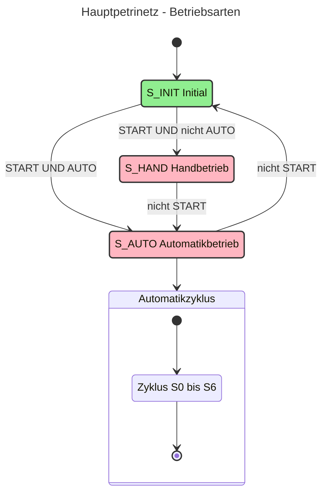
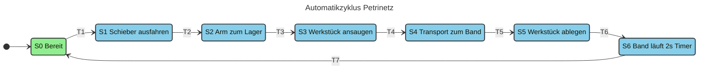
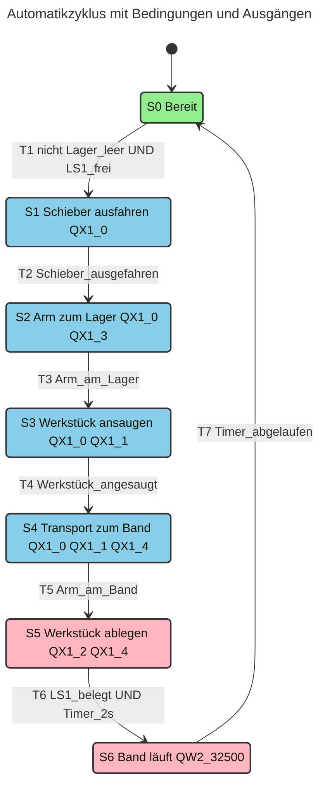
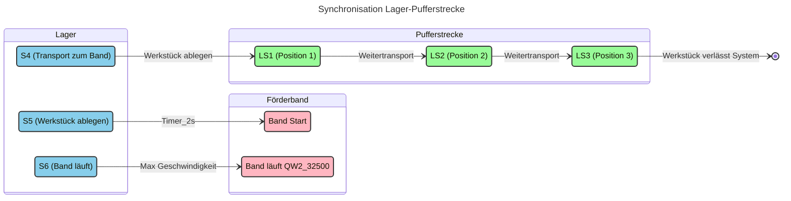
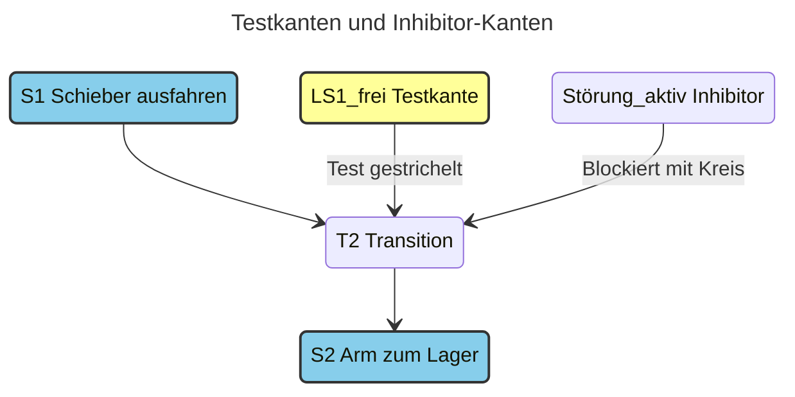
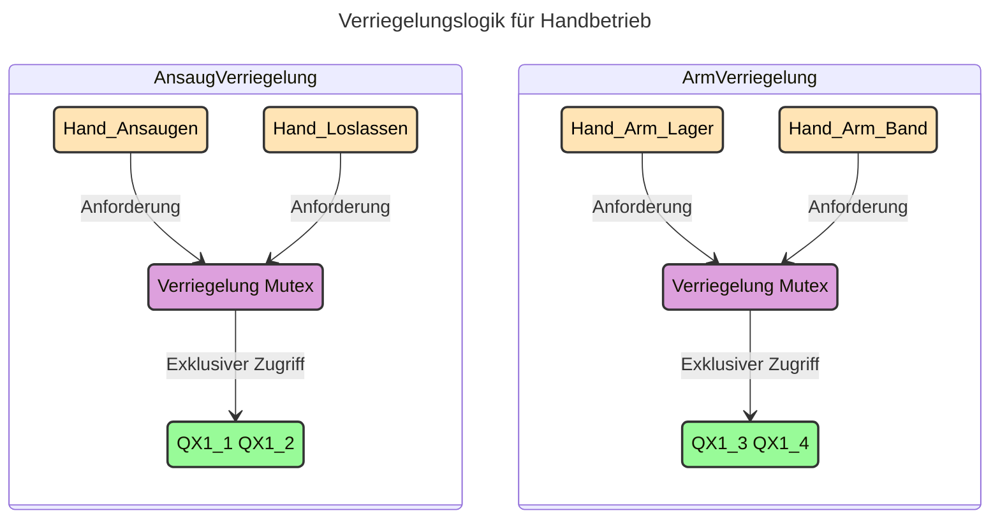
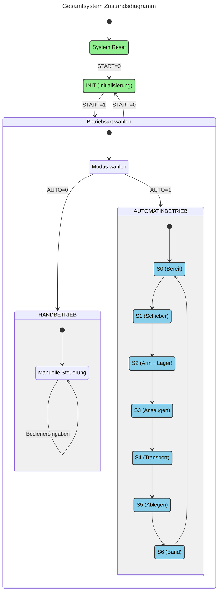
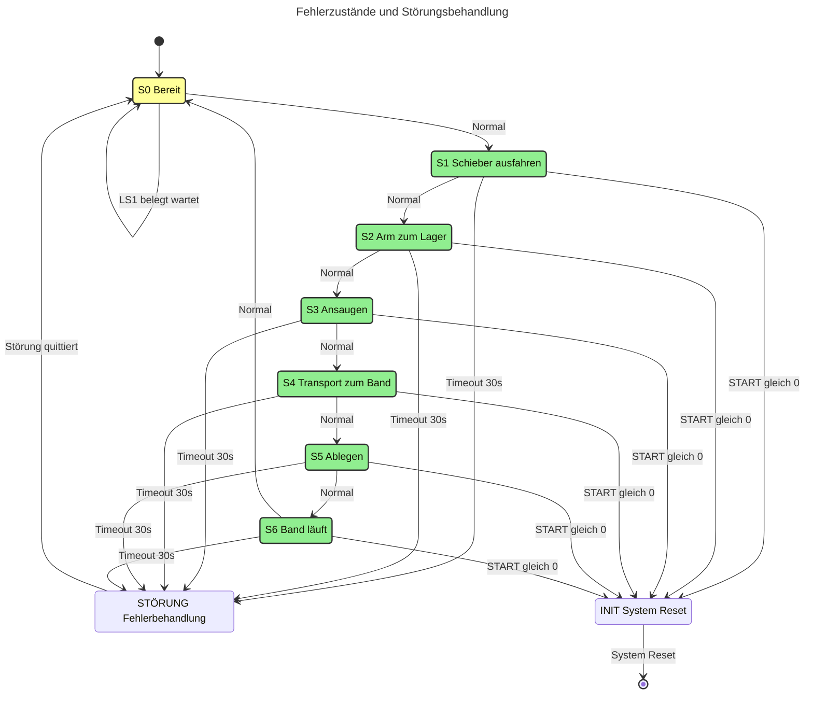
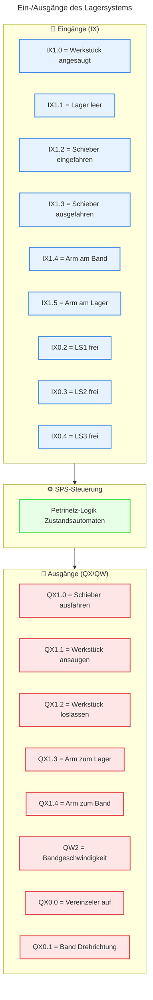

# Petrinetz-Grafik für Lagerbereich

## Hauptpetrinetz - Betriebsarten

## Automatikzyklus-Petrinetz (detailliert)

## Detaillierte Transitionen mit Bedingungen

## Synchronisation mit Pufferstrecke

## Kommunikationsplätze und Testkanten

**Erklärung:**
- **Testkante (LS1F)**: Prüft Bedingung ohne Token zu verbrauchen
- **Inhibitor-Kante (Störung)**: Blockiert Transition wenn aktiv

## Verriegelungen (Schlüsselplätze)

**Erklärung:**
- **Ansaug-Verriegelung**: Nur eine Aktion gleichzeitig (Ansaugen ODER Loslassen)
- **Arm-Verriegelung**: Nur eine Position gleichzeitig (Lager ODER Band)

## Zustandsdiagramm

## Zeitverhalten

```mermaid
---
title: Zeitverhalten des Automatikzyklus
---
gantt
    title Automatikzyklus Timing (ca. 15-30s)
    dateFormat X
    axisFormat %Ls
    
    section Zyklusphasen
    S0 Bereit           :s0, 0, 2s
    S1 Schieber ausfahren :s1, after s0, 3s
    S2 Arm zum Lager    :s2, after s1, 2s
    S3 Ansaugen         :s3, after s2, 3s
    S4 Transport zum Band :s4, after s3, 2s
    S5 Ablegen          :s5, after s4, 2s
    S6 Band läuft       :s6, after s5, 2s
    
    section Ausgänge
    QX1.0 Schieber      :active, after s0, 11s
    QX1.1 Ansaugen      :active, after s2, 5s
    QX1.2 Loslassen     :active, after s4, 2s
    QX1.3 Arm→Lager     :active, after s1, 2s
    QX1.4 Arm→Band      :active, after s3, 4s
    QW2 Bandgeschw.     :active, after s5, 2s
```

**Zeitbeschreibung:**
- **S0 (2s)**: Bereitschaftsphase, System wartet auf nächsten Zyklus
- **S1 (3s)**: Schieber fährt aus dem Lager aus
- **S2 (2s)**: Roboterarm bewegt sich zum Lager
- **S3 (3s)**: Werkstück wird angesaugt und fixiert
- **S4 (2s)**: Transport des Werkstücks zum Förderband
- **S5 (2s)**: Werkstück wird auf dem Band abgelegt
- **S6 (2s)**: Förderband läuft mit maximaler Geschwindigkeit

**Gesamtzykluszeit: ca. 16 Sekunden** (ohne Wartezeiten und Sicherheitspausen)

Timeout pro Schritt: 30s (Störungsüberwachung)  
Band-Timer: 2s (Zeittransition)

## Fehlerzustände

## I/O-Zuordnung kompakt

