# Petrinetz-Grafik für Lagerbereich

## Hauptpetrinetz - Betriebsarten


## Automatikzyklus-Petrinetz (detailliert)

```mermaid
---
title: Automatikzyklus Petrinetz
---
stateDiagram-v2
    direction LR
    classDef initialState fill:#90EE90,stroke:#333,stroke-width:2px
    classDef processState fill:#87CEEB,stroke:#333,stroke-width:2px
    
    [*] --> S0
    S0: S0 Bereit
    S1: S1 Schieber ausfahren
    S2: S2 Arm zum Lager
    S3: S3 Werkstück ansaugen
    S4: S4 Transport zum Band
    S5: S5 Werkstück ablegen
    S6: S6 Band läuft 2s Timer
    
    S0 --> S1 : T1
    S1 --> S2 : T2
    S2 --> S3 : T3
    S3 --> S4 : T4
    S4 --> S5 : T5
    S5 --> S6 : T6
    S6 --> S0 : T7
    
    class S0 initialState
    class S1,S2,S3,S4,S5,S6 processState
```


## Detaillierte Transitionen mit Bedingungen

```mermaid
---
title: Automatikzyklus mit Bedingungen und Ausgängen
---
stateDiagram-v2
    direction TB
    
    classDef initialState fill:#90EE90,stroke:#333,stroke-width:2px
    classDef processState fill:#87CEEB,stroke:#333,stroke-width:2px
    classDef outputState fill:#FFB6C1,stroke:#333,stroke-width:2px
    
    [*] --> S0
    S0: S0 Bereit
    S1: S1 Schieber ausfahren QX1_0
    S2: S2 Arm zum Lager QX1_0 QX1_3
    S3: S3 Werkstück ansaugen QX1_0 QX1_1
    S4: S4 Transport zum Band QX1_0 QX1_1 QX1_4
    S5: S5 Werkstück ablegen QX1_2 QX1_4
    S6: S6 Band läuft QW2_32500
    
    S0 --> S1 : T1 nicht Lager_leer UND LS1_frei
    S1 --> S2 : T2 Schieber_ausgefahren
    S2 --> S3 : T3 Arm_am_Lager
    S3 --> S4 : T4 Werkstück_angesaugt
    S4 --> S5 : T5 Arm_am_Band
    S5 --> S6 : T6 LS1_belegt UND Timer_2s
    S6 --> S0 : T7 Timer_abgelaufen
    
    class S0 initialState
    class S1,S2,S3,S4 processState
    class S5,S6 outputState
```


## Synchronisation mit Pufferstrecke


## Kommunikationsplätze und Testkanten

```mermaid
---
title: Testkanten und Inhibitor-Kanten
---
stateDiagram-v2
    direction TB
    
    classDef normalState fill:#87CEEB,stroke:#333,stroke-width:2px
    classDef testState fill:#FFFF99,stroke:#333,stroke-width:2px
    classDef inhibitorState fill:#FF6B6B,stroke:#333,stroke-width:2px
    
    S1: S1 Schieber ausfahren
    T2: T2 Transition
    S2: S2 Arm zum Lager
    LS1F: LS1_frei Testkante
    Störung: Störung_aktiv Inhibitor
    
    S1 --> T2
    T2 --> S2
    LS1F --> T2 : Test gestrichelt
    Störung --> T2 : Blockiert mit Kreis
    
    class S1,S2 normalState
    class LS1F testState
    class Störung inhibitorState
```



**Erklärung:**
- **Testkante (LS1F)**: Prüft Bedingung ohne Token zu verbrauchen
- **Inhibitor-Kante (Störung)**: Blockiert Transition wenn aktiv

## Verriegelungen (Schlüsselplätze)


**Erklärung:**
- **Ansaug-Verriegelung**: Nur eine Aktion gleichzeitig (Ansaugen ODER Loslassen)
- **Arm-Verriegelung**: Nur eine Position gleichzeitig (Lager ODER Band)

## Zustandsdiagramm

```mermaid
---
title: Gesamtsystem Zustandsdiagramm
---
stateDiagram-v2
    direction TB
    
    classDef initState fill:#90EE90,stroke:#333,stroke-width:2px
    classDef modeState fill:#FFE4B5,stroke:#333,stroke-width:2px,color:#000000
    classDef operationState fill:#87CEEB,stroke:#333,stroke-width:2px
    
    [*] --> SystemReset
    SystemReset: System Reset
    INIT: INIT (Initialisierung)
    BetriebsartWählen: Betriebsart wählen
    
    SystemReset --> INIT : START=0
    INIT --> BetriebsartWählen : START=1
    BetriebsartWählen --> INIT : START=0
    
    state BetriebsartWählen {
        [*] --> Auswahl
        Auswahl: Modus wählen
        Auswahl --> HANDBETRIEB : AUTO=0
        Auswahl --> AUTOMATIKBETRIEB : AUTO=1
        
        state HANDBETRIEB {
            [*] --> ManuellesteuerungAktiv
            ManuellesteuerungAktiv: Manuelle Steuerung
            ManuellesteuerungAktiv --> ManuellesteuerungAktiv : Bedienereingaben
        }
        
        state AUTOMATIKBETRIEB {
            [*] --> ZyklusS0
            ZyklusS0: S0 (Bereit)
            ZyklusS1: S1 (Schieber)
            ZyklusS2: S2 (Arm→Lager)
            ZyklusS3: S3 (Ansaugen)
            ZyklusS4: S4 (Transport)
            ZyklusS5: S5 (Ablegen)
            ZyklusS6: S6 (Band)
            
            ZyklusS0 --> ZyklusS1
            ZyklusS1 --> ZyklusS2
            ZyklusS2 --> ZyklusS3
            ZyklusS3 --> ZyklusS4
            ZyklusS4 --> ZyklusS5
            ZyklusS5 --> ZyklusS6
            ZyklusS6 --> ZyklusS0
        }
    }
    
    class SystemReset,INIT initState
    class BetriebsartWählen,HANDBETRIEB,AUTOMATIKBETRIEB modeState
    class ZyklusS0,ZyklusS1,ZyklusS2,ZyklusS3,ZyklusS4,ZyklusS5,ZyklusS6 operationState
```



## Zeitverhalten


**Zeitbeschreibung:**
- **S0 (2s)**: Bereitschaftsphase, System wartet auf nächsten Zyklus
- **S1 (3s)**: Schieber fährt aus dem Lager aus
- **S2 (2s)**: Roboterarm bewegt sich zum Lager
- **S3 (3s)**: Werkstück wird angesaugt und fixiert
- **S4 (2s)**: Transport des Werkstücks zum Förderband
- **S5 (2s)**: Werkstück wird auf dem Band abgelegt
- **S6 (2s)**: Förderband läuft mit maximaler Geschwindigkeit

**Gesamtzykluszeit: ca. 16 Sekunden** (ohne Wartezeiten und Sicherheitspausen)

Timeout pro Schritt: 30s (Störungsüberwachung)  
Band-Timer: 2s (Zeittransition)

## Fehlerzustände

```mermaid
---
title: Fehlerzustände und Störungsbehandlung
---
stateDiagram-v2
    direction TB
    
    classDef normalState fill:#90EE90,stroke:#333,stroke-width:2px
    classDef errorState fill:#FF6B6B,stroke:#333,stroke-width:2px
    classDef waitState fill:#FFFF99,stroke:#333,stroke-width:2px
    
    [*] --> S0
    S0: S0 Bereit
    S1: S1 Schieber ausfahren
    S2: S2 Arm zum Lager
    S3: S3 Ansaugen
    S4: S4 Transport zum Band
    S5: S5 Ablegen
    S6: S6 Band läuft
    STÖRUNG: STÖRUNG Fehlerbehandlung
    INIT: INIT System Reset
    
    %% Normale Ausführung
    S0 --> S1 : Normal
    S1 --> S2 : Normal
    S2 --> S3 : Normal
    S3 --> S4 : Normal
    S4 --> S5 : Normal
    S5 --> S6 : Normal
    S6 --> S0 : Normal
    
    %% Wartezustände
    S0 --> S0 : Lager leer wartet
    S0 --> S0 : LS1 belegt wartet
    
    %% Timeout-Fehler
    S1 --> STÖRUNG : Timeout 30s
    S2 --> STÖRUNG : Timeout 30s
    S3 --> STÖRUNG : Timeout 30s
    S4 --> STÖRUNG : Timeout 30s
    S5 --> STÖRUNG : Timeout 30s
    S6 --> STÖRUNG : Timeout 30s
    
    %% START gleich 0 Abbruch
    S1 --> INIT : START gleich 0
    S2 --> INIT : START gleich 0
    S3 --> INIT : START gleich 0
    S4 --> INIT : START gleich 0
    S5 --> INIT : START gleich 0
    S6 --> INIT : START gleich 0
    
    %% Fehlerbehandlung
    STÖRUNG --> S0 : Störung quittiert
    INIT --> [*] : System Reset
    
    class S1,S2,S3,S4,S5,S6 normalState
    class STÖRUNG errorState
    class S0 waitState
```



## I/O-Zuordnung kompakt

```mermaid
---
title: Ein-/Ausgänge des Lagersystems
---
flowchart TD
    subgraph Eingänge ["🔌 Eingänge (IX)"]
        IX10["IX1.0 = Werkstück angesaugt"]
        IX11["IX1.1 = Lager leer"]
        IX12["IX1.2 = Schieber eingefahren"]
        IX13["IX1.3 = Schieber ausgefahren"]
        IX14["IX1.4 = Arm am Band"]
        IX15["IX1.5 = Arm am Lager"]
        IX02["IX0.2 = LS1 frei"]
        IX03["IX0.3 = LS2 frei"]
        IX04["IX0.4 = LS3 frei"]
    end
    
    subgraph Steuerung ["⚙️ SPS-Steuerung"]
        PLC["Petrinetz-Logik Zustandsautomaten"]
    end
    
    subgraph Ausgänge ["🔌 Ausgänge (QX/QW)"]
        QX10["QX1.0 = Schieber ausfahren"]
        QX11["QX1.1 = Werkstück ansaugen"]
        QX12["QX1.2 = Werkstück loslassen"]
        QX13["QX1.3 = Arm zum Lager"]
        QX14["QX1.4 = Arm zum Band"]
        QW2["QW2 = Bandgeschwindigkeit"]
        QX00["QX0.0 = Vereinzeler auf"]
        QX01["QX0.1 = Band Drehrichtung"]
    end
    
    Eingänge --> Steuerung
    Steuerung --> Ausgänge
    
    classDef inputStyle fill:#E6F3FF,stroke:#4A90E2,stroke-width:2px
    classDef outputStyle fill:#FFE6E6,stroke:#E24A4A,stroke-width:2px
    classDef controlStyle fill:#E6FFE6,stroke:#4AE24A,stroke-width:2px
    
    class IX10,IX11,IX12,IX13,IX14,IX15,IX02,IX03,IX04 inputStyle
    class QX10,QX11,QX12,QX13,QX14,QW2,QX00,QX01 outputStyle
    class PLC controlStyle
```
