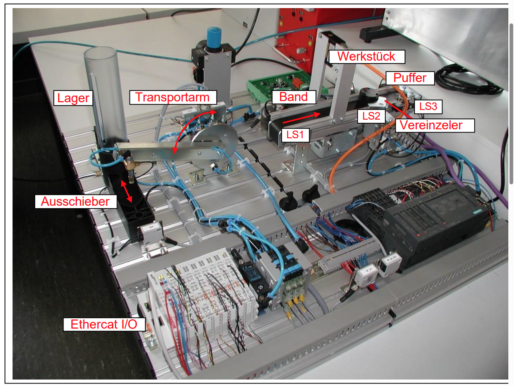

# ATP Labor 2 - Automatisierungstechnik Praktikum

## 🎯 Projektübersicht
Dokumentation der Laborversuche 1-3 für das Automatisierungstechnik-Praktikum an der HAW Hamburg.
Entwicklung einer SPS-Steuerung für ein Anlagenmodell bestehend aus Lagerbereich und Pufferstrecke.

- [ATP Labor 2 - Automatisierungstechnik Praktikum](#atp-labor-2---automatisierungstechnik-praktikum)
  - [🎯 Projektübersicht](#-projektübersicht)
  - [🏭 Anlagenmodell](#-anlagenmodell)
  - [🏗️ Projektstruktur](#️-projektstruktur)
  - [📚 Theoretische Grundlagen](#-theoretische-grundlagen)
    - [Vorlesungsunterlagen](#vorlesungsunterlagen)
    - [Theoretische Konzepte](#theoretische-konzepte)
  - [🔧 Technische Basis](#-technische-basis)
  - [📋 Laborversuche im Detail](#-laborversuche-im-detail)
    - [Laborversuch 1: Pufferstrecke](#laborversuch-1-pufferstrecke)
      - [Hauptfunktionen](#hauptfunktionen)
      - [Hardware (Pufferstrecke)](#hardware-pufferstrecke)
      - [Status](#status)
    - [Laborversuch 2: Petrinetz-Steuerung](#laborversuch-2-petrinetz-steuerung)
      - [Hauptfunktionen](#hauptfunktionen-1)
      - [Hardware (Lagerbereich)](#hardware-lagerbereich)
      - [Petrinetz-Zyklus](#petrinetz-zyklus)
      - [Status](#status-1)
    - [Laborversuch 3: Gesamtsystem-Integration](#laborversuch-3-gesamtsystem-integration)
      - [Hauptfunktionen](#hauptfunktionen-2)
      - [Funktionsblock-Interface](#funktionsblock-interface)
      - [Integration](#integration)
      - [Status](#status-2)
  - [🎯 Gesamtsystem-Architektur](#-gesamtsystem-architektur)
    - [Anlagenübersicht](#anlagenübersicht)
    - [Prozessablauf](#prozessablauf)
  - [🛠️ Entwicklungsstand](#️-entwicklungsstand)
    - [✅ Abgeschlossen](#-abgeschlossen)
    - [🔄 In Arbeit](#-in-arbeit)
  - [🎓 Lernziele](#-lernziele)

## 🏭 Anlagenmodell



*Mechatronisches Anlagenmodell mit Lagerbereich (links) und Pufferstrecke (rechts)*

## 🏗️ Projektstruktur
```
ATP_Labor2/
├── Laborversuch_1/          # Pufferstrecke mit Vereinzeler
│   └── README_Laborversuch_1.md
├── Laborversuch_2/          # Petrinetz für Lagerbereich
│   └── README_Laborversuch_2.md
├── Laborversuch_3/          # Gesamtsystem-Integration
│   └── README_Laborversuch_3.md
├── Vorlesungsunterlagen/    # Theoretische Grundlagen
│   ├── anlage.png
│   ├── BMT4-AT1-SoSe25-SLR-Kap5.pdf
│   ├── SIPN.pdf
│   └── SPIN REGELN.pdf
└── README.md               # Diese Übersichtsdatei
```

## 📚 Theoretische Grundlagen

### Vorlesungsunterlagen
- **[BMT4-AT1-SoSe25-SLR-Kap5.pdf](Vorlesungsunterlagen/BMT4-AT1-SoSe25-SLR-Kap5.pdf)** - Grundlagen der Automatisierungstechnik
- **[SIPN.pdf](Vorlesungsunterlagen/SIPN.pdf)** - Steuerungstechnisch Interpretierte Petrinetze
- **[SPIN REGELN.pdf](Vorlesungsunterlagen/SPIN%20REGELN.pdf)** - Regeln für SIPN-Implementierung
- **[anlage.png](Vorlesungsunterlagen/anlage.png)** - Anlagenmodell-Übersicht

### Theoretische Konzepte
- **Petrinetze:** Modellierung paralleler und nebenläufiger Systeme
- **SIPN:** Steuerungstechnische Interpretation von Petrinetzen
- **SPS-Programmierung:** Structured Text (ST) und Funktionsbausteinsprache (FUP)
- **Automatisierungsarchitektur:** Hierarchische Steuerungsstrukturen

## 🔧 Technische Basis
- **Hardware:** Mechatronisches Anlagenmodell mit EtherCAT I/O
- **Software:** CoDeSys SOFT-SPS auf PC
- **Programmiersprachen:** Structured Text (ST), Funktionsbausteinsprache (FUP)
- **Kommunikation:** EtherCAT Feldbussystem

## 📋 Laborversuche im Detail

### [Laborversuch 1: Pufferstrecke](Laborversuch_1/README_Laborversuch_1.md)
**Ziel:** Steuerung einer Pufferstrecke mit Förderband und Vereinzeler

#### Hauptfunktionen
- Förderbandsteuerung
- Vereinzeler-Logik
- Hand- und Automatikbetrieb

#### Hardware (Pufferstrecke)
```
Eingänge:
├── IX0.0: Vereinzeler ist auf
├── IX0.1: Vereinzeler ist zu
├── IX0.2: LS1 (Start)
├── IX0.3: LS2 (Vereinzeler)
└── IX0.4: LS3 (Ende)

Ausgänge:
├── QX0.0: Vereinzeler auf
├── QX0.1: Band Drehrichtung
└── QW2: Bandgeschwindigkeit
```

#### Status
- ✅ **Grundfunktionen:** Bandsteuerung implementiert
- ✅ **Vereinzeler-Logik:** Lichtschranken-basierte Steuerung
- ✅ **Visualisierung:** Bedien- und Anzeigeoberfläche
- ✅ **Testat:** Erfolgreich abgeschlossen

**→ [Detaillierte Dokumentation Laborversuch 1](Laborversuch_1/README_Laborversuch_1.md)**

---

### [Laborversuch 2: Petrinetz-Steuerung](Laborversuch_2/README_Laborversuch_2.md)
**Ziel:** Entwicklung eines Steuerungstechnisch Interpretierten Petrinetzes (SIPN) für den Lagerbereich

#### Hauptfunktionen
- **Petrinetz-Steuerung:** S0-S6
- **Betriebsarten:** S_INIT, S_HAND, S_AUTO
- **Automatikzyklus:** Werkstück aus Lager → Transport → Ablage auf Band
- **Sicherheitsfunktionen**

#### Hardware (Lagerbereich)
```
Eingänge:
├── IX1.0: Werkstück angesaugt
├── IX1.1: Lager leer
├── IX1.2: Ausschieber eingefahren
├── IX1.3: Ausschieber ausgefahren
├── IX1.4: Transportarm am Band
└── IX1.5: Transportarm am Lager

Ausgänge:
├── QX1.0: Schieber ausfahren
├── QX1.1: Werkstück ansaugen
├── QX1.2: Werkstück loslassen
├── QX1.3: Transportarm zum Lager
└── QX1.4: Transportarm zum Band
```

#### Petrinetz-Zyklus
```
S0 (Bereit) → S1 (Schieber) → S2 (Arm→Lager) → S3 (Ansaugen)
→ S4 (Transport) → S5 (Ablegen) → S6 (Band läuft) → S0
```

#### Status
- ✅ **SIPN-Design:** Vollständiges Petrinetz entworfen
- ✅ **ST-Implementierung:** Code in Structured Text
- ✅ **Betriebsarten:** Hand/Auto mit Sicherheitslogik
- ✅ **Timer/Zähler:** Band-Timer und Teile-Zählung
- ✅ **Testat:** Erfolgreich abgeschlossen

**→ [Detaillierte Dokumentation Laborversuch 2](Laborversuch_2/README_Laborversuch_2.md)**

---

### [Laborversuch 3: Gesamtsystem-Integration](Laborversuch_3/README_Laborversuch_3.md)
**Ziel:** Integration beider Teilsysteme mit Funktionsblock

#### Hauptfunktionen
- **Funktionsblock:** `FB_Bandsteuerung` für Pufferstrecke
- **System-Integration:** Versuch 1 + 2 als Gesamtanlage
- **Visualisierung:** Erweiterung der Anzeige
- **Koordination:** Lager ↔ Pufferstrecke

#### Funktionsblock-Interface
```st
FUNCTION_BLOCK FB_Bandsteuerung
VAR_INPUT
    Enable, Start_Band : BOOL;
    Geschwindigkeit : WORD;
    LS1_Start, LS2_Vereinzeler, LS3_Ende : BOOL;
    Vereinzeler_Auf, Vereinzeler_Zu : BOOL;
END_VAR
VAR_OUTPUT
    Band_Geschwindigkeit : WORD;
    Band_Richtung, Vereinzeler_Auf_Cmd : BOOL;
    Band_Laeuft : BOOL;
    Teile_Gezaehlt : INT;
    Status_Text : STRING(50);
END_VAR
```

#### Integration
- **S5/S6 → FB:** Petrinetz aktiviert Funktionsblock
- **FB → Petrinetz:** Band-Status steuert Übergänge
- **Handbetrieb:** Beide Bereiche manuell steuerbar
- **Produktionszählung:** Teile-Erfassung

#### Status
- ✅ **FB-Prototyp:** Interface-Definition erstellt
- 🔄 **Implementierung:** ST-Code in Entwicklung
- 🔄 **Integration:** Einbindung in Versuch 2
- ⏳ **Test:** Gesamtsystem-Validierung geplant

**→ [Detaillierte Dokumentation Laborversuch 3](Laborversuch_3/README_Laborversuch_3.md)**

## 🎯 Gesamtsystem-Architektur

### Anlagenübersicht
```
┌─────────────────┐    ┌──────────────────┐
│   LAGERBEREICH  │    │   PUFFERSTRECKE  │
│                 │    │                  │
│ • Magazin       │ ──→│ • Förderband     │
│ • Ausschieber   │    │ • Vereinzeler    │
│ • Transportarm  │    │ • 3 Lichtschranken│
│ • Saugeinrichtung│   │                  │
└─────────────────┘    └──────────────────┘
         │                       │
         └───────────┬───────────┘
                     │
            ┌─────────────────┐
            │  GESAMTSTEUERUNG │
            │                 │
            │ • Petrinetz S0-S6│
            │ • FB_Bandsteuerung│
            │ • Visualisierung │
            │ • Hand/Auto-Modi │
            └─────────────────┘
```

### Prozessablauf
1. **Werkstück bereitstellen:** Lager → Ausschieber → Transportarm
2. **Transport:** Saugeinrichtung → Bewegung zum Band
3. **Übergabe:** Werkstück auf Förderband ablegen
4. **Vereinzelung:** Pufferstrecke übernimmt → Vereinzeler → Zählung
5. **Zyklus:** Automatische Wiederholung

## 🛠️ Entwicklungsstand

### ✅ Abgeschlossen
- **Versuch 1:** Pufferstrecke
- **Versuch 2:** Petrinetz-Steuerung
- **Grundintegration:** Kommunikation beider Systeme

### 🔄 In Arbeit
- **Funktionsblock:** FB_Bandsteuerung in ST
- **Erweiterte Visualisierung:** HMI-Elemente
- **Gesamtsystem-Test:** Endlos-Betrieb

## 🎓 Lernziele
- SPS-Programmierung
- Petrinetz-Design
- Funktionsblöcke
- Systemintegration

---

**Status:** 🟢 Aktiv in Entwicklung | **Letzte Aktualisierung:** [Aktuelles Datum]
